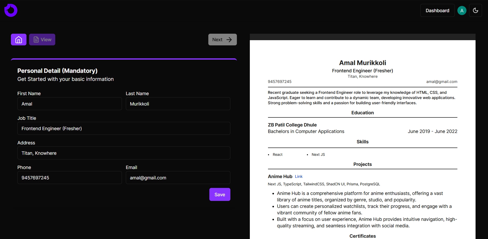

# Anime Hub Admin

AI resume admin is an application to build your resume with the help of AI.

Stack:- 
* I have developed this application using [Next JS](https://nextjs.org) with TypeScript, powered by it's app router.
* I have used [ShadCN UI](https://ui.shadcn.com), an awesome, accessible, highly configurable component library powered by [TailwindCSS](https://tailwindcss.com) for designing this app.
* I have used [Clerk](https://clerk.com) for authentication service.
* I have used [Sanity.io](https://www.sanity.io) to manage all the resume data.
* I have integerated Google Gemini AI  using [@google/generative-ai](https://www.npmjs.com/package/@google/generative-ai) sdk, and also got my free access token from [Google AI Studio](https://aistudio.google.com).

Cool features:-
* PWA support
* Dark mode
* Gemini AI
* Advanced Form Handling
* Rich Text Editor
* Downloading and sharing resume.

This is an excellent application to show my skills as a frontend engineer with the knowledge of building a fullstack application. I have used a ton of best practises and rules for building a scalable and maintainable application.

Please visit my [application](https://ai-resume-builder-client.vercel.app), and if you like it, give my repository a star.